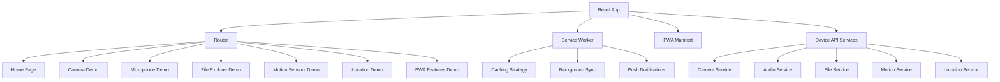

# Design Document

## Overview

The React PWA Showcase is a comprehensive demonstration application built with React 18+ and modern PWA technologies. The application will showcase various device capabilities through a clean, modular interface that works seamlessly across desktop and mobile devices. The architecture emphasizes progressive enhancement, graceful degradation, and educational value.

The application will be structured as a single-page application with multiple demo sections, each focusing on a specific device capability. It will be optimized for GitHub Pages deployment with static hosting requirements in mind.

## Architecture

### High-Level Architecture



### Technology Stack

- **Frontend Framework**: React 18+ with functional components and hooks
- **UI Framework**: Material-UI (MUI) v5+ for comprehensive component library and theming
- **Build Tool**: Vite for fast development and optimized production builds
- **Routing**: React Router v6 for client-side navigation
- **Styling**: MUI's emotion-based styling system with theme customization
- **Icons**: MUI Icons and additional icon libraries for device capabilities
- **PWA Tools**: Workbox for service worker generation and caching strategies
- **Deployment**: GitHub Pages with GitHub Actions for CI/CD
- **Device APIs**: Native Web APIs (MediaDevices, File System Access, Geolocation, etc.)
- **State Management**: React Context API with useReducer for complex state
- **Real-time Communication**: Socket.IO client for WebSocket demonstrations
- **Additional Libraries**:
  - Leaflet for interactive maps (location demo)
  - Chart.js or Recharts for data visualization (sensor data)
  - React Spring for smooth animations and transitions
  - Socket.IO client for real-time features
  - Leaflet for interactive maps (location demo)
  - Chart.js or Recharts for data visualization (sensor data)
  - React Spring for smooth animations and transitions

### Project Structure

```
src/
├── components/
│   ├── common/
│   │   ├── Header.jsx
│   │   ├── Navigation.jsx
│   │   ├── ErrorBoundary.jsx
│   │   └── PermissionHandler.jsx
│   └── demos/
│       ├── CameraDemo.jsx
│       ├── MicrophoneDemo.jsx
│       ├── FileExplorerDemo.jsx
│       ├── MotionSensorsDemo.jsx
│       ├── LocationDemo.jsx
│       ├── PWAFeaturesDemo.jsx
│       └── RealtimeDemo.jsx
├── services/
│   ├── cameraService.js
│   ├── audioService.js
│   ├── fileService.js
│   ├── motionService.js
│   ├── locationService.js
│   ├── notificationService.js
│   └── socketService.js
├── context/
│   ├── AppContext.js
│   ├── DeviceContext.js
│   ├── SocketContext.js
│   └── reducers/
│       ├── appReducer.js
│       ├── deviceReducer.js
│       └── socketReducer.js
├── hooks/
│   ├── useCamera.js
│   ├── useAudio.js
│   ├── useFileSystem.js
│   ├── useMotionSensors.js
│   ├── useGeolocation.js
│   ├── usePermissions.js
│   ├── useSocket.js
│   └── useAppContext.js
├── utils/
│   ├── deviceCapabilities.js
│   ├── errorHandling.js
│   └── constants.js
├── theme/
│   ├── index.js
│   ├── palette.js
│   ├── typography.js
│   └── components.js
├── pages/
│   ├── Home.jsx
│   └── DemoPage.jsx
└── App.jsx
```

## Components and Interfaces

### Core Components

#### App Component

- Main application wrapper with routing configuration
- MUI ThemeProvider with custom theme configuration
- Global error boundary implementation
- Service worker registration
- CssBaseline for consistent styling across browsers
- Responsive breakpoint management with MUI's useMediaQuery

#### Navigation Component

- MUI AppBar with responsive drawer navigation
- Material Design navigation patterns (BottomNavigation for mobile)
- Demo section links with capability detection using Chip components
- Installation prompt for PWA using Dialog components
- Offline status indicator with Snackbar notifications
- Dark/light theme toggle with IconButton

#### PermissionHandler Component

- Centralized permission management with MUI Dialog components
- User-friendly permission request flows using Stepper components
- Fallback content for denied permissions with Alert components
- Browser compatibility checks with informative Card layouts
- Permission status indicators using Chip and Badge components

### Demo Components

Each demo component follows a consistent pattern:

```javascript
// Example interface for demo components
interface DemoComponent {
  title: string;
  description: string;
  capabilities: string[];
  isSupported: boolean;
  permissionsRequired: string[];
  render(): JSX.Element;
}
```

#### CameraDemo Component

- Live camera preview with MediaStream API
- Photo capture with canvas-based image processing
- Video recording with MediaRecorder API
- Multiple camera selection (front/back)
- Image filters and effects demonstration

#### MicrophoneDemo Component

- Audio level visualization with Web Audio API
- Audio recording with MediaRecorder API
- Playback controls with custom audio player
- Audio analysis (frequency spectrum, volume detection)
- Voice activity detection

#### FileExplorerDemo Component

- File selection with drag-and-drop support
- File information display (size, type, last modified)
- Image preview and basic text file reading
- File download generation
- Directory access (where supported)

#### MotionSensorsDemo Component

- Real-time accelerometer data display
- Gyroscope data visualization
- Device orientation tracking
- Shake gesture detection
- Motion-based interactions (tilt controls)

#### LocationDemo Component

- Current position display with coordinates
- Interactive map integration (using Leaflet)
- Location tracking with position updates
- Distance calculation between points
- Geofencing demonstration

#### PWAFeaturesDemo Component

- Installation status and prompt
- Service worker status and updates
- Cache management demonstration
- Background sync examples
- Push notification setup and testing

## Data Models

### Device Capability Model

```javascript
interface DeviceCapability {
  name: string;
  isSupported: boolean;
  permissions: PermissionStatus[];
  apiAvailable: boolean;
  browserSupport: BrowserSupport;
}
```

### Permission Model

```javascript
interface PermissionRequest {
  type: "camera" | "microphone" | "location" | "notifications";
  status: "prompt" | "granted" | "denied";
  message: string;
  fallbackContent?: string;
}
```

### Media Capture Model

```javascript
interface MediaCapture {
  stream: MediaStream | null;
  isRecording: boolean;
  recordedData: Blob | null;
  duration: number;
  error: string | null;
}
```

### Location Model

```javascript
interface LocationData {
  latitude: number;
  longitude: number;
  accuracy: number;
  timestamp: number;
  address?: string;
}
```

## Error Handling

### Error Boundary Strategy

- Global error boundary for unhandled React errors
- Component-level error boundaries for demo sections
- Graceful degradation for unsupported features
- User-friendly error messages with recovery suggestions

### Permission Error Handling

- Clear messaging for denied permissions
- Alternative content when features are unavailable
- Step-by-step guides for enabling permissions
- Browser-specific permission instructions

### API Error Handling

- Network connectivity checks
- API availability detection
- Timeout handling for long-running operations
- Retry mechanisms for transient failures

### Browser Compatibility

- Feature detection before API usage
- Polyfills for partially supported features
- Progressive enhancement approach
- Fallback content for unsupported browsers

## Testing Strategy

### Unit Testing

- Jest and React Testing Library for component testing
- Service layer testing with mocked APIs
- Custom hook testing with renderHook
- Utility function testing with edge cases

### Integration Testing

- End-to-end testing with Playwright
- PWA functionality testing (installation, offline mode)
- Cross-browser compatibility testing
- Mobile device testing with responsive design

### Performance Testing

- Lighthouse audits for PWA compliance
- Bundle size analysis and optimization
- Runtime performance monitoring
- Memory usage testing for media operations

### Accessibility Testing

- WCAG 2.1 compliance verification
- Screen reader compatibility
- Keyboard navigation testing
- Color contrast and visual accessibility

## PWA Implementation Details

### Service Worker Strategy

- Workbox-generated service worker with custom caching rules
- Cache-first strategy for static assets
- Network-first strategy for API calls
- Background sync for offline actions

### Manifest Configuration

```json
{
  "name": "React PWA Showcase",
  "short_name": "PWA Showcase",
  "description": "Comprehensive demonstration of PWA capabilities",
  "start_url": "/",
  "display": "standalone",
  "theme_color": "#2196F3",
  "background_color": "#ffffff",
  "icons": [
    {
      "src": "/icons/icon-192x192.png",
      "sizes": "192x192",
      "type": "image/png"
    },
    {
      "src": "/icons/icon-512x512.png",
      "sizes": "512x512",
      "type": "image/png"
    }
  ]
}
```

### Caching Strategy

- Static assets: Cache-first with versioning
- API responses: Network-first with fallback
- Media files: Cache on demand with size limits
- Dynamic content: Stale-while-revalidate

## Deployment Architecture

### GitHub Pages Setup

- Vite build configuration for GitHub Pages
- Custom domain support with HTTPS
- GitHub Actions workflow for automated deployment
- Branch protection and deployment environments

### Build Optimization

- Code splitting for demo components
- Tree shaking for unused dependencies
- Asset optimization (images, fonts)
- Service worker precaching manifest

### CI/CD Pipeline

```yaml
# GitHub Actions workflow outline
name: Deploy to GitHub Pages
on:
  push:
    branches: [main]
jobs:
  build-and-deploy:
    - Checkout code
    - Setup Node.js
    - Install dependencies
    - Run tests
    - Build application
    - Deploy to GitHub Pages
```

## Security Considerations

### Permission Management

- Minimal permission requests
- Clear permission purpose explanation
- Secure handling of sensitive data
- No persistent storage of personal information

### Content Security Policy

- Strict CSP headers for XSS prevention
- Trusted sources for external resources
- Inline script restrictions
- Media source validation

### Data Privacy

- No data collection or analytics
- Local-only data processing
- Clear privacy information
- GDPR compliance considerations

## UI Framework Integration (Material-UI)

### Theme Configuration

The application will use a custom MUI theme that emphasizes the showcase nature while maintaining excellent usability:

```javascript
// Custom theme configuration
const theme = createTheme({
  palette: {
    mode: "light", // Support for dark mode toggle
    primary: {
      main: "#2196F3", // Modern blue for tech showcase
      light: "#64B5F6",
      dark: "#1976D2",
    },
    secondary: {
      main: "#FF5722", // Accent color for interactive elements
      light: "#FF8A65",
      dark: "#D84315",
    },
    success: {
      main: "#4CAF50", // For permission granted states
    },
    warning: {
      main: "#FF9800", // For capability warnings
    },
    error: {
      main: "#F44336", // For permission denied/errors
    },
  },
  typography: {
    fontFamily: '"Roboto", "Helvetica", "Arial", sans-serif',
    h1: {
      fontSize: "2.5rem",
      fontWeight: 300,
    },
    h2: {
      fontSize: "2rem",
      fontWeight: 400,
    },
    // Custom variants for demo sections
    demoTitle: {
      fontSize: "1.5rem",
      fontWeight: 500,
      color: "#2196F3",
    },
  },
  components: {
    MuiCard: {
      styleOverrides: {
        root: {
          borderRadius: 12,
          boxShadow: "0 4px 6px rgba(0, 0, 0, 0.1)",
        },
      },
    },
    MuiButton: {
      styleOverrides: {
        root: {
          borderRadius: 8,
          textTransform: "none",
          fontWeight: 500,
        },
      },
    },
  },
});
```

### Component Layout Strategy

#### Home Page Layout

- MUI Container with maxWidth="lg" for optimal reading width
- Grid system for responsive demo card layout
- Card components for each demo section with:
  - CardMedia for demo previews/icons
  - CardContent for descriptions
  - CardActions for navigation buttons
- Fab (Floating Action Button) for PWA installation

#### Demo Page Layout

- AppBar with back navigation and demo title
- Container with demo-specific content areas
- Paper components for content sections
- Accordion components for implementation details
- BottomNavigation for demo section switching on mobile

#### Interactive Elements

- Button variants (contained, outlined, text) for different action types
- IconButton for media controls (play, pause, record)
- Switch components for feature toggles
- Slider components for sensor data visualization
- Progress indicators (Linear, Circular) for loading states
- Snackbar for user feedback and notifications

### Responsive Design with MUI

#### Breakpoint Strategy

```javascript
// Custom breakpoints for optimal device support
const theme = createTheme({
  breakpoints: {
    values: {
      xs: 0, // Mobile portrait
      sm: 600, // Mobile landscape / small tablet
      md: 960, // Tablet
      lg: 1280, // Desktop
      xl: 1920, // Large desktop
    },
  },
});
```

#### Component Responsiveness

- Grid system with responsive breakpoints for demo cards
- Hidden components for device-specific content
- useMediaQuery hook for conditional rendering
- Responsive typography scaling
- Adaptive navigation (AppBar on desktop, BottomNavigation on mobile)

### Accessibility Enhancements

MUI provides excellent accessibility out of the box, which we'll enhance with:

- Proper ARIA labels for all interactive elements
- Focus management for modal dialogs and navigation
- High contrast mode support
- Screen reader optimized content structure
- Keyboard navigation support for all demo interactions
- Color-blind friendly color palette choices

### Performance Optimizations

- Tree shaking of unused MUI components
- Custom theme with only required component overrides
- Lazy loading of heavy demo components
- Optimized bundle splitting for MUI dependencies
- Efficient re-rendering with React.memo for MUI components

This UI framework integration will provide:

1. **Professional appearance** with Material Design principles
2. **Consistent user experience** across all devices
3. **Accessibility compliance** out of the box
4. **Rapid development** with pre-built components
5. **Easy customization** through theme system
6. **Mobile-first responsive design** with proven patterns

## State Management Architecture

### Context API Implementation

The application will use React Context API with useReducer for managing complex state across components. This approach provides:

- Centralized state management without external dependencies
- Type-safe state updates with reducer patterns
- Efficient re-rendering with context splitting
- Easy testing and debugging

### Context Structure

#### AppContext

Global application state including theme, user preferences, and PWA status:

```javascript
// AppContext structure
const AppContext = createContext();

const initialAppState = {
  theme: "light",
  isOnline: true,
  isPWAInstalled: false,
  notifications: [],
  user: {
    id: null,
    name: "Anonymous User",
    preferences: {
      autoPermissions: false,
      showHints: true,
    },
  },
};

const appReducer = (state, action) => {
  switch (action.type) {
    case "TOGGLE_THEME":
      return { ...state, theme: state.theme === "light" ? "dark" : "light" };
    case "SET_ONLINE_STATUS":
      return { ...state, isOnline: action.payload };
    case "ADD_NOTIFICATION":
      return {
        ...state,
        notifications: [...state.notifications, action.payload],
      };
    case "REMOVE_NOTIFICATION":
      return {
        ...state,
        notifications: state.notifications.filter(
          (n) => n.id !== action.payload
        ),
      };
    case "SET_PWA_INSTALLED":
      return { ...state, isPWAInstalled: action.payload };
    default:
      return state;
  }
};
```

#### DeviceContext

Device capabilities and permissions state:

```javascript
// DeviceContext structure
const DeviceContext = createContext();

const initialDeviceState = {
  permissions: {
    camera: "prompt",
    microphone: "prompt",
    location: "prompt",
    notifications: "prompt",
  },
  capabilities: {
    camera: null,
    microphone: null,
    location: null,
    motion: null,
    fileSystem: null,
  },
  activeStreams: {
    camera: null,
    microphone: null,
  },
  sensorData: {
    motion: { x: 0, y: 0, z: 0 },
    location: { lat: null, lng: null, accuracy: null },
  },
};

const deviceReducer = (state, action) => {
  switch (action.type) {
    case "SET_PERMISSION":
      return {
        ...state,
        permissions: {
          ...state.permissions,
          [action.payload.type]: action.payload.status,
        },
      };
    case "SET_CAPABILITY":
      return {
        ...state,
        capabilities: {
          ...state.capabilities,
          [action.payload.type]: action.payload.supported,
        },
      };
    case "SET_ACTIVE_STREAM":
      return {
        ...state,
        activeStreams: {
          ...state.activeStreams,
          [action.payload.type]: action.payload.stream,
        },
      };
    case "UPDATE_SENSOR_DATA":
      return {
        ...state,
        sensorData: {
          ...state.sensorData,
          [action.payload.type]: action.payload.data,
        },
      };
    default:
      return state;
  }
};
```

#### SocketContext

Real-time communication state:

```javascript
// SocketContext structure
const SocketContext = createContext();

const initialSocketState = {
  socket: null,
  isConnected: false,
  connectionError: null,
  room: "showcase-demo",
  users: [],
  messages: [],
  sharedData: {
    locations: [],
    sensorReadings: [],
  },
};

const socketReducer = (state, action) => {
  switch (action.type) {
    case "SET_SOCKET":
      return { ...state, socket: action.payload };
    case "SET_CONNECTION_STATUS":
      return {
        ...state,
        isConnected: action.payload,
        connectionError: action.payload ? null : state.connectionError,
      };
    case "SET_CONNECTION_ERROR":
      return { ...state, connectionError: action.payload, isConnected: false };
    case "ADD_USER":
      return {
        ...state,
        users: [
          ...state.users.filter((u) => u.id !== action.payload.id),
          action.payload,
        ],
      };
    case "REMOVE_USER":
      return {
        ...state,
        users: state.users.filter((u) => u.id !== action.payload),
      };
    case "ADD_MESSAGE":
      return {
        ...state,
        messages: [...state.messages, action.payload],
      };
    case "UPDATE_SHARED_DATA":
      return {
        ...state,
        sharedData: {
          ...state.sharedData,
          [action.payload.type]: action.payload.data,
        },
      };
    default:
      return state;
  }
};
```

### Custom Hooks for State Management

#### useAppContext Hook

```javascript
const useAppContext = () => {
  const context = useContext(AppContext);
  if (!context) {
    throw new Error("useAppContext must be used within AppProvider");
  }
  return context;
};

// Usage example
const { state, dispatch } = useAppContext();
const toggleTheme = () => dispatch({ type: "TOGGLE_THEME" });
```

#### useDeviceContext Hook

```javascript
const useDeviceContext = () => {
  const context = useContext(DeviceContext);
  if (!context) {
    throw new Error("useDeviceContext must be used within DeviceProvider");
  }
  return context;
};
```

## Socket.IO Integration

### Real-time Communication Architecture

The Socket.IO integration will demonstrate modern real-time web capabilities:

#### Socket Service Implementation

```javascript
// socketService.js
import io from "socket.io-client";

class SocketService {
  constructor() {
    this.socket = null;
    this.serverUrl =
      process.env.NODE_ENV === "production"
        ? "https://your-socket-server.herokuapp.com"
        : "http://localhost:3001";
  }

  connect(userId, userName) {
    this.socket = io(this.serverUrl, {
      auth: { userId, userName },
      transports: ["websocket", "polling"],
    });

    return new Promise((resolve, reject) => {
      this.socket.on("connect", () => {
        console.log("Connected to server");
        resolve(this.socket);
      });

      this.socket.on("connect_error", (error) => {
        console.error("Connection failed:", error);
        reject(error);
      });
    });
  }

  disconnect() {
    if (this.socket) {
      this.socket.disconnect();
      this.socket = null;
    }
  }

  // Real-time messaging
  sendMessage(message) {
    if (this.socket) {
      this.socket.emit("message", message);
    }
  }

  onMessage(callback) {
    if (this.socket) {
      this.socket.on("message", callback);
    }
  }

  // Location sharing
  shareLocation(locationData) {
    if (this.socket) {
      this.socket.emit("location-update", locationData);
    }
  }

  onLocationUpdate(callback) {
    if (this.socket) {
      this.socket.on("location-update", callback);
    }
  }

  // Sensor data sharing
  shareSensorData(sensorData) {
    if (this.socket) {
      this.socket.emit("sensor-data", sensorData);
    }
  }

  onSensorData(callback) {
    if (this.socket) {
      this.socket.on("sensor-data", callback);
    }
  }

  // User management
  onUserJoined(callback) {
    if (this.socket) {
      this.socket.on("user-joined", callback);
    }
  }

  onUserLeft(callback) {
    if (this.socket) {
      this.socket.on("user-left", callback);
    }
  }
}

export default new SocketService();
```

#### useSocket Custom Hook

```javascript
// useSocket.js
import { useEffect, useContext } from "react";
import { SocketContext } from "../context/SocketContext";
import socketService from "../services/socketService";

export const useSocket = () => {
  const { state, dispatch } = useContext(SocketContext);

  const connect = async (userId, userName) => {
    try {
      const socket = await socketService.connect(userId, userName);
      dispatch({ type: "SET_SOCKET", payload: socket });
      dispatch({ type: "SET_CONNECTION_STATUS", payload: true });

      // Set up event listeners
      setupEventListeners(socket, dispatch);
    } catch (error) {
      dispatch({ type: "SET_CONNECTION_ERROR", payload: error.message });
    }
  };

  const disconnect = () => {
    socketService.disconnect();
    dispatch({ type: "SET_CONNECTION_STATUS", payload: false });
    dispatch({ type: "SET_SOCKET", payload: null });
  };

  const sendMessage = (message) => {
    socketService.sendMessage({
      id: Date.now(),
      text: message,
      timestamp: new Date().toISOString(),
      userId: state.currentUser?.id,
    });
  };

  const shareLocation = (locationData) => {
    socketService.shareLocation({
      userId: state.currentUser?.id,
      ...locationData,
      timestamp: new Date().toISOString(),
    });
  };

  const shareSensorData = (sensorData) => {
    socketService.shareSensorData({
      userId: state.currentUser?.id,
      ...sensorData,
      timestamp: new Date().toISOString(),
    });
  };

  return {
    ...state,
    connect,
    disconnect,
    sendMessage,
    shareLocation,
    shareSensorData,
  };
};

const setupEventListeners = (socket, dispatch) => {
  socket.on("message", (message) => {
    dispatch({ type: "ADD_MESSAGE", payload: message });
  });

  socket.on("user-joined", (user) => {
    dispatch({ type: "ADD_USER", payload: user });
  });

  socket.on("user-left", (userId) => {
    dispatch({ type: "REMOVE_USER", payload: userId });
  });

  socket.on("location-update", (locationData) => {
    dispatch({
      type: "UPDATE_SHARED_DATA",
      payload: { type: "locations", data: locationData },
    });
  });

  socket.on("sensor-data", (sensorData) => {
    dispatch({
      type: "UPDATE_SHARED_DATA",
      payload: { type: "sensorReadings", data: sensorData },
    });
  });

  socket.on("disconnect", () => {
    dispatch({ type: "SET_CONNECTION_STATUS", payload: false });
  });
};
```

### RealtimeDemo Component

The real-time demo will showcase:

#### Features

- **Live Chat**: Real-time messaging between connected users
- **Location Sharing**: Share and view other users' locations on a map
- **Sensor Broadcasting**: Share motion sensor data in real-time
- **User Presence**: See who's currently connected
- **Connection Status**: Visual indicators for connection health

#### Component Structure

```javascript
// RealtimeDemo.jsx
const RealtimeDemo = () => {
  const { isConnected, users, messages, connect, sendMessage } = useSocket();
  const { state: deviceState } = useDeviceContext();
  const [chatMessage, setChatMessage] = useState("");

  useEffect(() => {
    // Auto-connect when component mounts
    connect(generateUserId(), "Demo User");

    return () => {
      // Cleanup on unmount
      disconnect();
    };
  }, []);

  return (
    <Container maxWidth="lg">
      <Grid container spacing={3}>
        {/* Connection Status */}
        <Grid item xs={12}>
          <ConnectionStatus
            isConnected={isConnected}
            userCount={users.length}
          />
        </Grid>

        {/* Live Chat */}
        <Grid item xs={12} md={6}>
          <ChatInterface messages={messages} onSendMessage={sendMessage} />
        </Grid>

        {/* Shared Location Map */}
        <Grid item xs={12} md={6}>
          <SharedLocationMap
            locations={sharedData.locations}
            currentLocation={deviceState.sensorData.location}
          />
        </Grid>

        {/* Real-time Sensor Data */}
        <Grid item xs={12}>
          <SensorDataVisualization sensorReadings={sharedData.sensorReadings} />
        </Grid>
      </Grid>
    </Container>
  );
};
```

### Socket.IO Server Considerations

For the demo to work, we'll need a simple Socket.IO server. The design includes:

#### Deployment Options

1. **Heroku**: Free tier for demo purposes
2. **Railway**: Modern alternative with good free tier
3. **Render**: Simple deployment with WebSocket support
4. **Local Development**: Node.js server for development

#### Server Features

- Room-based communication for demo isolation
- User management and presence tracking
- Message broadcasting and history
- Location and sensor data relay
- Connection health monitoring

This state management and Socket.IO integration will provide:

1. **Centralized State**: Clean, predictable state management
2. **Real-time Features**: Modern WebSocket communication
3. **Educational Value**: Demonstrate both Context API and Socket.IO patterns
4. **Scalable Architecture**: Easy to extend with additional features
5. **Type Safety**: Well-structured state with clear action patterns
