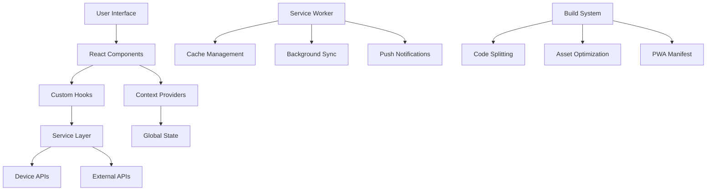
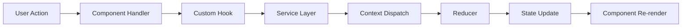

# Architecture Overview

This document provides a comprehensive overview of the React PWA Showcase architecture, design patterns, and technical decisions.

## Table of Contents

- [System Architecture](#system-architecture)
- [Component Architecture](#component-architecture)
- [State Management](#state-management)
- [Service Layer](#service-layer)
- [PWA Architecture](#pwa-architecture)
- [Performance Architecture](#performance-architecture)
- [Security Architecture](#security-architecture)
- [Testing Architecture](#testing-architecture)
- [Build Architecture](#build-architecture)
- [Deployment Architecture](#deployment-architecture)

## System Architecture

### High-Level Overview



### Technology Stack

#### Frontend Core
- **React 18+**: UI library with concurrent features
- **TypeScript**: Type safety and developer experience
- **Vite**: Fast build tool and development server
- **Material-UI v5**: Component library and design system

#### State Management
- **React Context API**: Global state management
- **useReducer**: Complex state logic
- **Custom Hooks**: Reusable stateful logic

#### PWA Technologies
- **Workbox**: Service worker generation and management
- **Web App Manifest**: PWA configuration
- **IndexedDB**: Client-side storage
- **Cache API**: Resource caching

#### Device APIs
- **MediaDevices API**: Camera and microphone access
- **Geolocation API**: Location services
- **DeviceMotion API**: Motion sensors
- **File System Access API**: File operations
- **Web Audio API**: Audio processing

#### Real-time Communication
- **Socket.IO**: WebSocket communication
- **WebRTC**: Peer-to-peer communication (future)

## Component Architecture

### Component Hierarchy

```
App
├── ThemeProvider (MUI)
├── CssBaseline (MUI)
├── Router
│   ├── Header
│   │   ├── Navigation
│   │   └── ThemeToggle
│   ├── Routes
│   │   ├── Home
│   │   │   ├── DemoCard[]
│   │   │   └── FeatureGrid
│   │   ├── CameraDemo
│   │   │   ├── CameraControls
│   │   │   ├── CameraPreview
│   │   │   └── PhotoGallery
│   │   ├── MicrophoneDemo
│   │   │   ├── AudioControls
│   │   │   ├── AudioVisualizer
│   │   │   └── RecordingsList
│   │   └── [Other Demos]
│   └── ErrorBoundary
└── PerformanceMetrics (dev only)
```

### Component Design Patterns

#### 1. Container/Presentational Pattern

```typescript
// Container Component (Logic)
const CameraDemoContainer: React.FC = () => {
  const { stream, error, startCamera, stopCamera } = useCamera();
  const { capturedPhotos, capturePhoto } = usePhotoCapture(stream);
  
  return (
    <CameraDemoPresentation
      stream={stream}
      error={error}
      photos={capturedPhotos}
      onStartCamera={startCamera}
      onStopCamera={stopCamera}
      onCapturePhoto={capturePhoto}
    />
  );
};

// Presentational Component (UI)
interface CameraDemoPresentationProps {
  stream: MediaStream | null;
  error: string | null;
  photos: string[];
  onStartCamera: () => void;
  onStopCamera: () => void;
  onCapturePhoto: () => void;
}

const CameraDemoPresentation: React.FC<CameraDemoPresentationProps> = ({
  stream,
  error,
  photos,
  onStartCamera,
  onStopCamera,
  onCapturePhoto
}) => {
  // Pure UI rendering
};
```

#### 2. Compound Component Pattern

```typescript
// Main component
const CameraDemo = ({ children }: { children: React.ReactNode }) => {
  const cameraContext = useCamera();
  
  return (
    <CameraContext.Provider value={cameraContext}>
      <div className="camera-demo">
        {children}
      </div>
    </CameraContext.Provider>
  );
};

// Sub-components
CameraDemo.Controls = CameraControls;
CameraDemo.Preview = CameraPreview;
CameraDemo.Gallery = PhotoGallery;

// Usage
<CameraDemo>
  <CameraDemo.Controls />
  <CameraDemo.Preview />
  <CameraDemo.Gallery />
</CameraDemo>
```

#### 3. Render Props Pattern

```typescript
interface CameraRenderProps {
  stream: MediaStream | null;
  isActive: boolean;
  error: string | null;
  startCamera: () => Promise<void>;
  stopCamera: () => void;
}

const CameraProvider: React.FC<{
  children: (props: CameraRenderProps) => React.ReactNode;
}> = ({ children }) => {
  const cameraProps = useCamera();
  return <>{children(cameraProps)}</>;
};

// Usage
<CameraProvider>
  {({ stream, isActive, startCamera, stopCamera }) => (
    <div>
      {isActive ? <video srcObject={stream} /> : null}
      <button onClick={startCamera}>Start</button>
      <button onClick={stopCamera}>Stop</button>
    </div>
  )}
</CameraProvider>
```

### Component Guidelines

1. **Single Responsibility**: Each component has one clear purpose
2. **Composition over Inheritance**: Build complex UIs from simple components
3. **Props Interface**: Well-defined TypeScript interfaces
4. **Error Boundaries**: Wrap components that might fail
5. **Accessibility**: ARIA labels and keyboard navigation

## State Management

### Context Architecture

```typescript
// App-level state structure
interface AppState {
  theme: 'light' | 'dark';
  user: User | null;
  notifications: Notification[];
  loading: boolean;
  error: string | null;
}

// Device-level state structure
interface DeviceState {
  permissions: {
    camera: PermissionState;
    microphone: PermissionState;
    location: PermissionState;
    notifications: PermissionState;
  };
  capabilities: {
    camera: boolean;
    microphone: boolean;
    location: boolean;
    motionSensors: boolean;
    fileSystem: boolean;
  };
  sensors: {
    motion: MotionData | null;
    location: LocationData | null;
  };
}

// Socket-level state structure
interface SocketState {
  isConnected: boolean;
  isConnecting: boolean;
  error: string | null;
  messages: Message[];
  users: User[];
}
```

### State Flow



### Context Providers Hierarchy

```typescript
const App: React.FC = () => (
  <AppProvider>
    <DeviceProvider>
      <SocketProvider>
        <ThemeProvider theme={theme}>
          <Router>
            <AppContent />
          </Router>
        </ThemeProvider>
      </SocketProvider>
    </DeviceProvider>
  </AppProvider>
);
```

## Service Layer

### Service Architecture

```typescript
// Base service interface
interface BaseService {
  initialize(): Promise<void>;
  cleanup(): void;
  isSupported(): boolean;
}

// Camera service implementation
class CameraService implements BaseService {
  private stream: MediaStream | null = null;
  
  async initialize(): Promise<void> {
    if (!this.isSupported()) {
      throw new Error('Camera not supported');
    }
  }
  
  isSupported(): boolean {
    return 'mediaDevices' in navigator && 'getUserMedia' in navigator.mediaDevices;
  }
  
  async getStream(constraints: MediaStreamConstraints): Promise<MediaStream> {
    this.stream = await navigator.mediaDevices.getUserMedia(constraints);
    return this.stream;
  }
  
  cleanup(): void {
    if (this.stream) {
      this.stream.getTracks().forEach(track => track.stop());
      this.stream = null;
    }
  }
}
```

### Service Registry

```typescript
class ServiceRegistry {
  private services = new Map<string, BaseService>();
  
  register<T extends BaseService>(name: string, service: T): void {
    this.services.set(name, service);
  }
  
  get<T extends BaseService>(name: string): T {
    const service = this.services.get(name);
    if (!service) {
      throw new Error(`Service ${name} not found`);
    }
    return service as T;
  }
  
  async initializeAll(): Promise<void> {
    const promises = Array.from(this.services.values()).map(service => 
      service.initialize()
    );
    await Promise.all(promises);
  }
}

// Usage
const serviceRegistry = new ServiceRegistry();
serviceRegistry.register('camera', new CameraService());
serviceRegistry.register('location', new LocationService());
serviceRegistry.register('socket', new SocketService());
```

## PWA Architecture

### Service Worker Strategy

```typescript
// Service worker registration and lifecycle
class ServiceWorkerManager {
  private registration: ServiceWorkerRegistration | null = null;
  
  async register(): Promise<ServiceWorkerRegistration> {
    if ('serviceWorker' in navigator) {
      this.registration = await navigator.serviceWorker.register('/sw.js');
      
      // Handle updates
      this.registration.addEventListener('updatefound', () => {
        const newWorker = this.registration!.installing;
        if (newWorker) {
          newWorker.addEventListener('statechange', () => {
            if (newWorker.state === 'installed' && navigator.serviceWorker.controller) {
              // New version available
              this.notifyUpdate();
            }
          });
        }
      });
      
      return this.registration;
    }
    throw new Error('Service workers not supported');
  }
  
  private notifyUpdate(): void {
    // Show update notification to user
  }
}
```

### Caching Strategy

```typescript
// Workbox configuration
const cacheStrategies = {
  // App shell - Cache First
  appShell: new CacheFirst({
    cacheName: 'app-shell-v1',
    plugins: [
      new ExpirationPlugin({
        maxEntries: 50,
        maxAgeSeconds: 30 * 24 * 60 * 60, // 30 days
      }),
    ],
  }),
  
  // API responses - Network First
  api: new NetworkFirst({
    cacheName: 'api-cache-v1',
    networkTimeoutSeconds: 3,
    plugins: [
      new ExpirationPlugin({
        maxEntries: 100,
        maxAgeSeconds: 5 * 60, // 5 minutes
      }),
    ],
  }),
  
  // Static assets - Stale While Revalidate
  assets: new StaleWhileRevalidate({
    cacheName: 'assets-cache-v1',
    plugins: [
      new CacheableResponsePlugin({
        statuses: [0, 200],
      }),
    ],
  }),
};
```

### Offline Strategy

```typescript
// Offline detection and handling
class OfflineManager {
  private isOnline = navigator.onLine;
  private callbacks: Array<(online: boolean) => void> = [];
  
  constructor() {
    window.addEventListener('online', () => this.setOnlineStatus(true));
    window.addEventListener('offline', () => this.setOnlineStatus(false));
  }
  
  private setOnlineStatus(online: boolean): void {
    this.isOnline = online;
    this.callbacks.forEach(callback => callback(online));
  }
  
  onStatusChange(callback: (online: boolean) => void): () => void {
    this.callbacks.push(callback);
    return () => {
      const index = this.callbacks.indexOf(callback);
      if (index > -1) {
        this.callbacks.splice(index, 1);
      }
    };
  }
  
  getStatus(): boolean {
    return this.isOnline;
  }
}
```

## Performance Architecture

### Code Splitting Strategy

```typescript
// Route-based splitting
const CameraDemo = lazy(() => import('./pages/CameraDemo'));
const MicrophoneDemo = lazy(() => import('./pages/MicrophoneDemo'));
const LocationDemo = lazy(() => import('./pages/LocationDemo'));

// Component-based splitting
const HeavyChart = lazy(() => import('./components/HeavyChart'));

// Feature-based splitting
const AdminPanel = lazy(() => import('./features/admin/AdminPanel'));
```

### Bundle Analysis

```typescript
// Webpack bundle analyzer configuration
const BundleAnalyzerPlugin = require('webpack-bundle-analyzer').BundleAnalyzerPlugin;

module.exports = {
  plugins: [
    new BundleAnalyzerPlugin({
      analyzerMode: 'static',
      openAnalyzer: false,
      reportFilename: 'bundle-report.html',
    }),
  ],
};
```

### Performance Monitoring

```typescript
// Performance metrics collection
class PerformanceMonitor {
  private metrics: Map<string, number> = new Map();
  
  markStart(name: string): void {
    performance.mark(`${name}-start`);
  }
  
  markEnd(name: string): void {
    performance.mark(`${name}-end`);
    performance.measure(name, `${name}-start`, `${name}-end`);
    
    const measure = performance.getEntriesByName(name, 'measure')[0];
    this.metrics.set(name, measure.duration);
  }
  
  getMetrics(): Record<string, number> {
    return Object.fromEntries(this.metrics);
  }
  
  reportMetrics(): void {
    // Send metrics to analytics service
  }
}
```

## Security Architecture

### Content Security Policy

```typescript
// CSP configuration
const cspDirectives = {
  defaultSrc: ["'self'"],
  scriptSrc: ["'self'", "'unsafe-inline'", "https://apis.google.com"],
  styleSrc: ["'self'", "'unsafe-inline'", "https://fonts.googleapis.com"],
  imgSrc: ["'self'", "data:", "blob:", "https:"],
  connectSrc: ["'self'", "wss:", "https:"],
  mediaSrc: ["'self'", "blob:"],
  workerSrc: ["'self'", "blob:"],
};
```

### Permission Management

```typescript
// Secure permission handling
class PermissionManager {
  private permissions = new Map<string, PermissionState>();
  
  async requestPermission(type: PermissionName): Promise<PermissionState> {
    try {
      // Check if permission is already granted
      const existing = await navigator.permissions.query({ name: type });
      if (existing.state === 'granted') {
        return 'granted';
      }
      
      // Request permission based on type
      let result: PermissionState;
      switch (type) {
        case 'camera':
          await navigator.mediaDevices.getUserMedia({ video: true });
          result = 'granted';
          break;
        case 'geolocation':
          await new Promise((resolve, reject) => {
            navigator.geolocation.getCurrentPosition(resolve, reject);
          });
          result = 'granted';
          break;
        default:
          result = 'denied';
      }
      
      this.permissions.set(type, result);
      return result;
    } catch (error) {
      this.permissions.set(type, 'denied');
      return 'denied';
    }
  }
}
```

### Data Privacy

```typescript
// Privacy-first data handling
class DataManager {
  private readonly STORAGE_KEY = 'pwa-showcase-data';
  
  // Store data locally only
  storeData(key: string, data: any): void {
    const encrypted = this.encrypt(JSON.stringify(data));
    localStorage.setItem(`${this.STORAGE_KEY}-${key}`, encrypted);
  }
  
  // Retrieve data locally
  getData(key: string): any | null {
    const encrypted = localStorage.getItem(`${this.STORAGE_KEY}-${key}`);
    if (!encrypted) return null;
    
    try {
      const decrypted = this.decrypt(encrypted);
      return JSON.parse(decrypted);
    } catch {
      return null;
    }
  }
  
  // Clear all stored data
  clearAllData(): void {
    Object.keys(localStorage)
      .filter(key => key.startsWith(this.STORAGE_KEY))
      .forEach(key => localStorage.removeItem(key));
  }
  
  private encrypt(data: string): string {
    // Simple encryption for demo purposes
    return btoa(data);
  }
  
  private decrypt(data: string): string {
    return atob(data);
  }
}
```

## Testing Architecture

### Test Pyramid Implementation

```typescript
// Unit tests (70%)
describe('CameraService', () => {
  it('should initialize camera stream', async () => {
    const service = new CameraService();
    const stream = await service.getStream({ video: true });
    expect(stream).toBeInstanceOf(MediaStream);
  });
});

// Integration tests (20%)
describe('CameraDemo Integration', () => {
  it('should capture photo when camera is active', async () => {
    render(<CameraDemo />);
    
    // Start camera
    fireEvent.click(screen.getByText('Start Camera'));
    await waitFor(() => expect(screen.getByTestId('video')).toBeInTheDocument());
    
    // Capture photo
    fireEvent.click(screen.getByText('Capture'));
    await waitFor(() => expect(screen.getByTestId('photo')).toBeInTheDocument());
  });
});

// E2E tests (10%)
test('complete camera workflow', async ({ page }) => {
  await page.goto('/camera');
  await page.click('text=Start Camera');
  await page.click('text=Capture');
  await expect(page.locator('[data-testid="photo"]')).toBeVisible();
});
```

### Mock Strategy

```typescript
// Service mocks
class MockCameraService implements CameraService {
  async getStream(): Promise<MediaStream> {
    // Return mock stream
    return new MediaStream();
  }
  
  isSupported(): boolean {
    return true;
  }
}

// API mocks with MSW
const handlers = [
  rest.get('/api/user', (req, res, ctx) => {
    return res(ctx.json({ id: '1', name: 'Test User' }));
  }),
];

const server = setupServer(...handlers);
```

## Build Architecture

### Vite Configuration

```typescript
// vite.config.ts
export default defineConfig({
  plugins: [
    react(),
    VitePWA({
      registerType: 'autoUpdate',
      workbox: {
        globPatterns: ['**/*.{js,css,html,ico,png,svg}'],
        runtimeCaching: [
          {
            urlPattern: /^https:\/\/api\./,
            handler: 'NetworkFirst',
            options: {
              cacheName: 'api-cache',
              expiration: {
                maxEntries: 100,
                maxAgeSeconds: 60 * 5, // 5 minutes
              },
            },
          },
        ],
      },
    }),
  ],
  build: {
    rollupOptions: {
      output: {
        manualChunks: {
          vendor: ['react', 'react-dom'],
          mui: ['@mui/material', '@mui/icons-material'],
          charts: ['recharts', 'chart.js'],
        },
      },
    },
  },
});
```

### Asset Optimization

```typescript
// Image optimization
const imageOptimization = {
  // Responsive images
  srcSet: [
    { width: 320, quality: 75 },
    { width: 640, quality: 80 },
    { width: 1280, quality: 85 },
  ],
  
  // Format optimization
  formats: ['webp', 'avif', 'jpg'],
  
  // Lazy loading
  loading: 'lazy' as const,
};

// Font optimization
const fontOptimization = {
  preload: ['Inter-Regular.woff2', 'Inter-Medium.woff2'],
  display: 'swap' as const,
  fallback: 'system-ui, sans-serif',
};
```

## Deployment Architecture

### CI/CD Pipeline

```yaml
# GitHub Actions workflow
name: Build and Deploy

on:
  push:
    branches: [main]

jobs:
  build-and-deploy:
    runs-on: ubuntu-latest
    
    steps:
      - name: Checkout
        uses: actions/checkout@v3
      
      - name: Setup Node.js
        uses: actions/setup-node@v3
        with:
          node-version: '18'
          cache: 'npm'
      
      - name: Install dependencies
        run: npm ci
      
      - name: Run tests
        run: npm run test:ci
      
      - name: Build
        run: npm run build
        env:
          VITE_BASE_URL: ${{ secrets.BASE_URL }}
      
      - name: Deploy to GitHub Pages
        uses: peaceiris/actions-gh-pages@v3
        with:
          github_token: ${{ secrets.GITHUB_TOKEN }}
          publish_dir: ./dist
```

### Environment Configuration

```typescript
// Environment-specific configuration
const config = {
  development: {
    apiUrl: 'http://localhost:3000',
    socketUrl: 'ws://localhost:3001',
    debug: true,
    analytics: false,
  },
  
  staging: {
    apiUrl: 'https://staging-api.example.com',
    socketUrl: 'wss://staging-socket.example.com',
    debug: true,
    analytics: true,
  },
  
  production: {
    apiUrl: 'https://api.example.com',
    socketUrl: 'wss://socket.example.com',
    debug: false,
    analytics: true,
  },
};

export default config[import.meta.env.MODE as keyof typeof config];
```

### Monitoring and Analytics

```typescript
// Application monitoring
class ApplicationMonitor {
  private analytics: Analytics;
  private errorReporting: ErrorReporting;
  
  constructor() {
    this.analytics = new Analytics(config.analyticsId);
    this.errorReporting = new ErrorReporting(config.sentryDsn);
  }
  
  trackPageView(path: string): void {
    this.analytics.track('page_view', { path });
  }
  
  trackEvent(event: string, properties: Record<string, any>): void {
    this.analytics.track(event, properties);
  }
  
  reportError(error: Error, context?: Record<string, any>): void {
    this.errorReporting.captureException(error, context);
  }
  
  trackPerformance(metrics: PerformanceMetrics): void {
    this.analytics.track('performance', metrics);
  }
}
```

This architecture provides a solid foundation for building scalable, maintainable, and performant PWA applications while following modern best practices and design patterns.